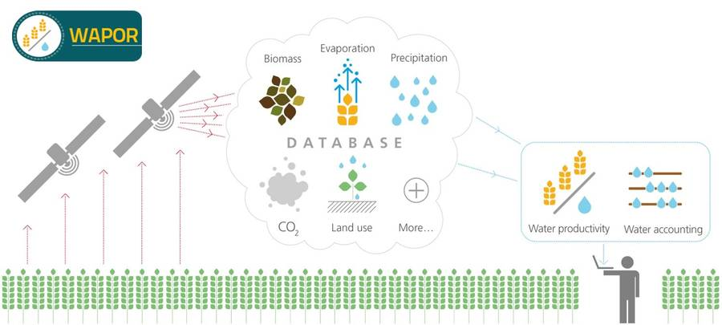

# WaPOR-based Water Accounting 

Authors: 
- Bich Tran (b.tran@un-ihe.org)
- Solomon Seyoum 
- Claire Michailovsky 
- Bert Coerver 

With contributions from:

- Marloes Mul
- Quan Pan 
- Elga Salvadore 
- Tim Hessels

## 1. About

This repository contains ipython notebooks, python scripts for the rapid Water Accounting analysis using WaPOR data in 5 river basins: Litani, Jordan, Awash, Niger, Nile. This work is done by the Water Accounting group at IHE-DELFT Institute for Water Education as a part of the WaPOR programme of The Food and Agriculture Organization of the United Nations (FAO).

http://www.fao.org/in-action/remote-sensing-for-water-productivity/overview/about-the-programme/en/

## 2. Installation

### 2.1. Python environment

  - dask=2.27.* 
  - gdal=2.3.*
  - matplotlib=3.3.* 
  - netcdf4=1.4.*
  - notebook=6.1.1=py37_0
  - numpy=1.19.* 
  - pandas=1.1.* 
  - pip=20.1.1=py37_1
  - pyshp=2.1.* 
  - python=3.7.*
  - shapely=1.6.* 
  - tqdm=4.49.* 
  - xarray=0.16.*  
  - geopy==2.0.*
  - requests=2.24.*

#### Recommended steps to set up python environment in Anaconda prompt

**Change to folder contain environment.yml file**

	>>> D:
	>>> cd Github/WAPORWA

**Create environment from environment.yml file**

	>>> conda create env

**Activate environment**

	>>> conda activate waporwa

## For more information see [Wiki](https://github.com/wateraccounting/WAPORWA/wiki)
