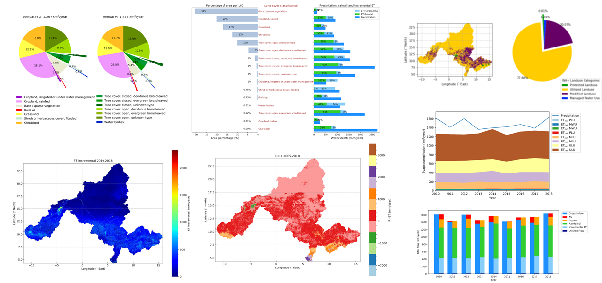

# WaPOR-based Water Accounting 

Authors: 
- Bich Tran (b.tran@un-ihe.org)
- Solomon Seyoum 
- Claire Michailovsky 
- Bert Coerver 

With contributions from:

- Marloes Mul
- Quan Pan 
- Elga Salvadore 
- Tim Hessels

## 1. About

This repository contains ipython notebooks, python scripts for the rapid Water Accounting analysis using WaPOR data in 5 river basins: Litani, Jordan, Awash, Niger, Nile. This work is done by the Water Accounting group at IHE-DELFT Institute for Water Education as a part of the WaPOR programme of The Food and Agriculture Organization of the United Nations (FAO).

http://www.fao.org/in-action/remote-sensing-for-water-productivity/overview/about-the-programme/en/

### 1.2. About WaPOR

Link: https://wapor.apps.fao.org/

FAO's web portal to monitor Water Productivity through Open-access of Remotely sensed derived data (WaPOR). This portal covers Africa and the Near East, with remotely sensed data, to monitor, in near real time, agricultural water and land productivity as well carbon dioxide uptake by vegetation.

For information about the programme, please visit: http://www.fao.org/in-action/remote-sensing-for-water-productivity/en/

### 1.3. About Water Accounting

Link: https://www.wateraccounting.org/

Water accounting is the process of communicating water resources related information and the services generated from consumptive use in a geographical domain, such as a river basin, a country or a land use class; to users such as policy makers, water authorities, managers, etc.

For more recent softwares developed by Water Accounting group at IHE-DELFT Institute for Water Education, please visit: https://github.com/wateraccounting

## 2. Description

### 2.1. Python environment

  - dask=2.27.* 
  - gdal=2.3.*
  - matplotlib=3.3.* 
  - netcdf4=1.4.*
  - notebook=6.1.1=py37_0
  - numpy=1.19.* 
  - pandas=1.1.* 
  - pip=20.1.1=py37_1
  - pyshp=2.1.* 
  - python=3.7.*
  - shapely=1.6.* 
  - tqdm=4.49.* 
  - xarray=0.16.*  
  - geopy==2.0.*
  - requests=2.24.*

#### Recommended steps to set up python environment in Anaconda prompt

**Change to folder contain environment.yml file**

	>>> D:
	>>> cd Github/WAPORWA

**Create environment from environment.yml file**

	>>> conda create env

**Activate environment**

	>>> conda activate waporwa

### 2.2. Modules

#### 2.2.1. Workflow and notebooks

**Example notebooks**: 
[Sample Case Study - Litani River Basin](./notebooks/)

#### 2.2.2. Pre-processing modules

[**:notebook: Notebook** Collect and Prepare data](./notebooks/0_Collect_Prepare_data.ipynb)

- Create Landuse categories reclassification maps from WaPOR Landcover maps and other global maps
- Create Rootdepth map from WaPOR Landcover map and lookup table
- Calculate monthly number of rainy days from daily precipitation layers
- Calculate monthly data layers from dekadal ones

[**:notebook: Notebook** Create input netCDF files](./notebooks/1_Create_NetCDF.ipynb)

#### 2.2.3. Monthly Pixel-based Soil Moisture Balance module 

[**:notebook: Notebook** Run model](./notebooks/3_RunSMBalance.ipynb)

[**See Model Documentation**](https://github.com/trngbich/WAPORWA/wiki/Monthly-Pixel-based-Soil-Moisture-Balance)

#### 2.2.4. Basin fluxes calculation module

[**:notebook: Notebook** Calculate Basin Total Water Storage Change from GRACE](./notebooks/2_GRACE_dS.ipynb)

[**:notebook: Notebook** Calculate Sheet 1 fluxes](./notebooks/4_calc_Sheet1_fluxes.ipynb)

### 2.3. Inputs

#### 2.3.1. WaPOR data (v2.0)

| Data layers        | Resolution           | WAPOR cube_code  |
| ------------- |:-------------:| -----:|
| Precipitation      | Daily, 5km | L1_PCP_E |
| Precipitation      | Monthly, 5km      |   L1_PCP_M |
| Actual Evapotranspiration and Interception      | Monthly, 100m      |   L2_AETI_M |
| Interception      | Dekadal, 100m      |   L2_I_D |
| Land Cover Classification     | Yearly, 100m      |   L2_LCC_A |
| Reference Evapotranspiration      | Monthly, 20km      |   L2_RET_M |

#### 2.3.2. Other data

| Data layers       | Resolution           | Sources  |
| ------------- |:-------------:| -----:|
| Top soil saturated water content      | Static, 5km | HiHydroSoils |
| Protected Area      | Static, shapefile | WDPA |
| Reservoirs      | Static, shapefile | GRaND |
| Basin delineation      | Static, shapefile | HydroSHED |

| Data time-series        | Resolution           | Sources  |
| ------------- |:-------------:| -----:|
| Total Water Storage Change | Monthly, mascon | GRACE-GFCS |
| Observed flows      | Monthly, point | GRDC (unless mentioned otherwise) |

Global input dataset: [Download data](./data/Download_global_input_data.md)

#### 2.3.3. Test dataset

Test dataset for Litani case: [Download data](./data/Download_Litani_test_case.md)

### 2.4. Outputs

#### 2.4.1. Output data
| Data layers       | Resolution           | DataType  |
| ------------- |:-------------:| -----:|
| Incremental Evapotranspiration      | Monthly, 100m | netCDF |
| Rainfall Evapotranspiration      | Monthly, 100m | netCDF |
| Incremental Evapotranspiration      | Yearly, 100m | netCDF |
| Rainfall Evapotranspiration      | Yearly, 100m | netCDF |

| Data time-series        | Resolution           | DataType  |
| ------------- |:-------------:| -----:|
| WA+ Sheet 1 | Yearly, Basin | csv |
| P and ET per Land cover class | Yearly, LCC | csv |
| P and ET | Yearly, Basin | csv |

#### 2.4.2. Water Accounting Sheet 1: Resource Base

[**See WA+ Sheet 1 documentation**](https://github.com/trngbich/WAPORWA/wiki/Water-Accounting-Plus-(WA-)---Sheet-1:-Resource-Base)

#### 2.4.3. Water Accounting maps and charts

